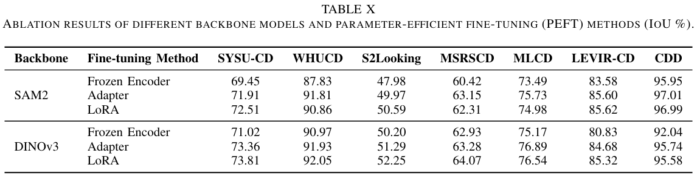

# PeftCD: Leveraging Vision Foundation Models with Parameter-Efficient Fine-Tuning for Remote Sensing Change Detection

[](https://opensource.org/licenses/MIT)
<!-- [](https://arxiv.org/abs/[insert_arxiv_if_available])   -->
[](https://github.com/dyzy41/PeftCD)

Official PyTorch implementation of **PeftCD**, a novel bitemporal change detection network that utilize the VFMs fintuning methods in remote sensing change detection. The paper has been accepted at [IEEE TGRS](https://ieeexplore.ieee.org/document/11396066)!!

## Paper

**Title:** PeftCD: Leveraging Vision Foundation Models with Parameter-Efficient Fine-Tuning for Remote Sensing Change Detection

**Authors:** Sijun Dong; Yuxuan Hu; Libo Wang; Geng Chen; Xiaoliang Meng*  
*School of Remote Sensing and Information Engineering, Wuhan University, Wuhan, China*  

**Abstract:**

To tackle the prevalence of spurious changes, the scarcity of annotations, and the difficulty of cross-domain transfer in multi-temporal and multi-source remote sensing imagery, we propose PeftCD, a change detection framework built upon Vision Foundation Models (VFMs) with Parameter-Efficient Fine-Tuning (PEFT). Specifically, PeftCD adopts a shared-weights Siamese encoder instantiated from a VFM, into which LoRA and Adapter modules are injected as fine-tuning strategies, so that only a small number of additional parameters need to be trained for task adaptation. To better explore the potential of VFMs in change detection, we investigate two representative backbones: the Segment Anything Model v2 (SAM2), which provides strong segmentation priors, and DINOv3, a state-of-the-art self-supervised representation learner. Meanwhile, PeftCD employs a deliberately minimal and efficient decoder to highlight the representational capacity of the backbone models. Extensive experiments demonstrate that PeftCD achieves state-of-the-art performance across multiple public datasets, including SYSU-CD (IoU 73.81%), WHUCD (92.05%), MSRSCD (64.07%), MLCD (76.89%), CDD (97.01%), S2Looking (52.25%) and LEVIR-CD (85.62%), with notably precise boundary delineation and strong suppression of pseudo-changes. Overall, PeftCD achieves a favorable balance among accuracy, efficiency, and generalization, offering an efficient paradigm for adapting VFMs to practical remote sensing change detection. The code and pretrained weights are available at https://github.com/dyzy41/PeftCD.

The source code and pre-trained weights are available at https://github.com/dyzy41/PeftCD.

## Quantitative Results (Test Set Performance)



## running steps

``bash install_env.sh``  
``bash run.sh``

## Citation 

 If you use this code for your research, please cite our papers.  

```
@ARTICLE{11458815,
  author={Dong, Sijun and Hu, Yuxuan and Wang, Libo and Chen, Geng and Meng, Xiaoliang},
  journal={IEEE Journal of Selected Topics in Applied Earth Observations and Remote Sensing}, 
  title={PeftCD: Leveraging Vision Foundation Models with Parameter-Efficient Fine-Tuning for Remote Sensing Change Detection}, 
  year={2026},
  volume={},
  number={},
  pages={1-16},
  keywords={Earth Observing System;Satellite images;Feeds;LoRa;Pixel;Communication systems;Internet;Electronic mail;Computer networks;Data communication;Remote Sensing Change Detection;Vision Foundation Models;Parameter-Efficient Fine-Tuning},
  doi={10.1109/JSTARS.2026.3679260}}
```

## Some other change detection repositories 
[ChangeCLIP](https://github.com/dyzy41/PeftCD)  
[CSDNet](https://github.com/dyzy41/CSDNet)  
[EfficientCD](https://github.com/dyzy41/mmrscd)  
[Open-CD](https://github.com/likyoo/open-cd)  